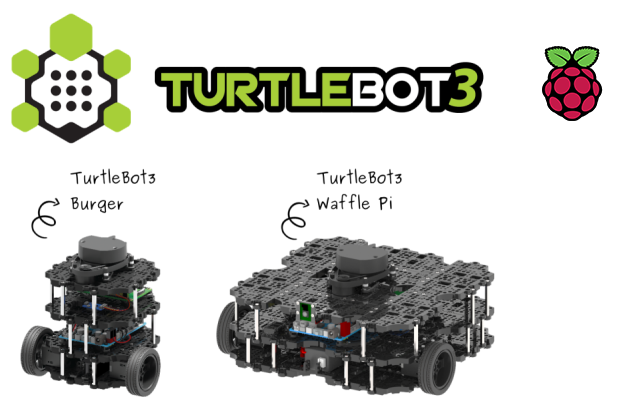
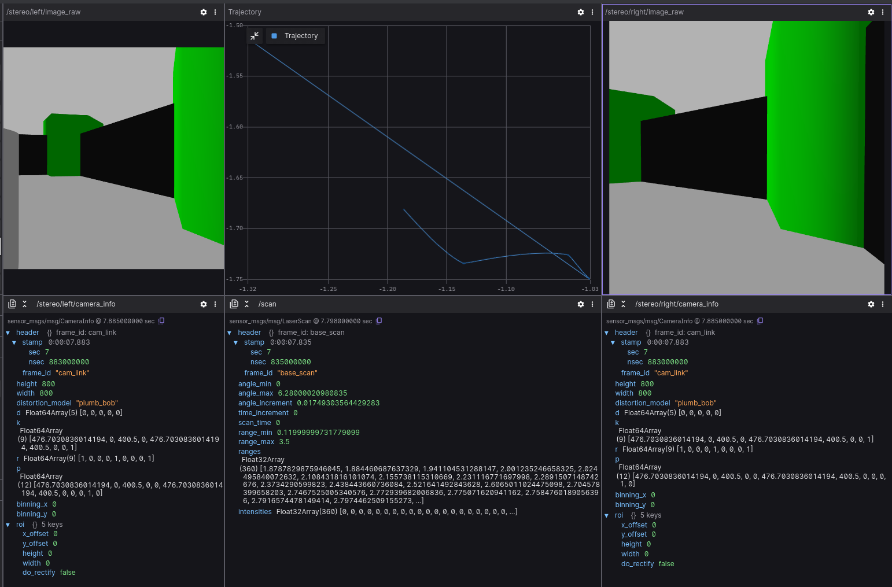
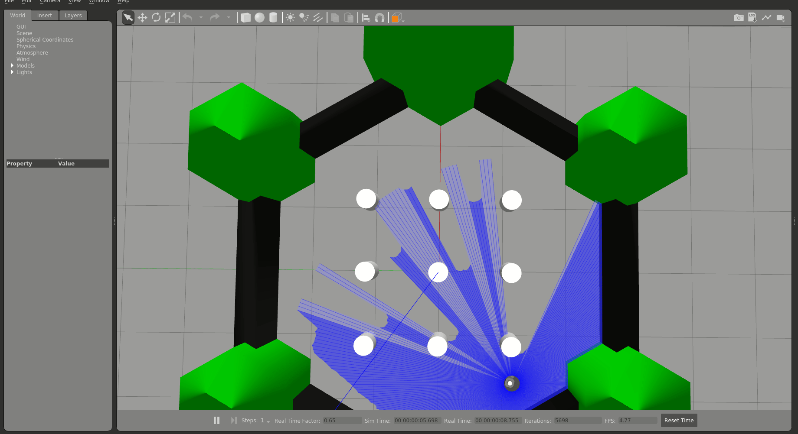

## Example overview 🌐 



This project is designed to wrap the official TurtleBot3 simulation [example](https://emanual.robotis.com/docs/en/platform/turtlebot3/simulation/#gazebo-simulation) and integrate it with a simple Autonomous Collision Avoidance node. The node provides ROS parameters that allow users to adjust various TurtleBot3 specifications, enabling the analysis of how these changes affect collision avoidance behavior. The primary functionalities of this node are as follows:

* Integration with TurtleBot3 Simulation: The ROS node interfaces with the official TurtleBot3 simulation example, leveraging the TurtleBot3 robot model and simulated environment. This integration allows users to observe how the robot behaves in a controlled environment.

* Autonomous Collision Avoidance: The node includes a simple Autonomous Collision Avoidance module. This module is responsible for ensuring that the TurtleBot3 avoids collisions with obstacles in its path. It utilizes sensor data, such as simulated lidar readings, to detect obstacles and adjust the robot's trajectory accordingly.

* User-Adjustable Parameters: The ROS parameters provided by this node give users the flexibility to modify various TurtleBot3 specifications. These parameters may include attributes like the robot's size, speed, sensor range, or collision avoidance algorithms. Users can experiment with different parameter values to observe their impact on collision avoidance behavior.

* Orientation and Navigation: The TurtleBot3 robot is capable of orienting itself effectively within a prepared TurtleBot3 world. It utilizes the simulated lidar module to gather environmental data, allowing it to make informed decisions about its navigation path.


## Local Usage 💻

All project installation and usage information also available in the project [GitHub page](https://github.com/citros-garden/turtlebot3).

### Installation 🔨
1. Docker engine. This project runs inside Docker container, and requires Docker Engine/Docker Desktop. Follow the instructions on [Docker official website](https://www.docker.com/get-started/).
2. To use Docker inside VS Code several extensions are required. Install [Dev Containers](https://marketplace.visualstudio.com/items?itemName=ms-vscode-remote.remote-containers) and [Docker](https://marketplace.visualstudio.com/items?itemName=ms-azuretools.vscode-docker) extensions from Extensions tab on your left control panel.
3. Clone the repository:
```bash 
git git@github.com:citros-garden/turtlebot3.git
```

### Build 🏠
1. Open project root folder in VS Code.
2. Navigate to the lower-left corner of VS Code window and click on green mark.
3. Select "Reopen in container" option in the list on the top of the VS Code window. Wait a minute while Docker container is starting.
2. Open ```/src/turtlebot3_gazebo/config/params.xml``` file to set parameters for simulation or just keep it default. Don't forget to save your changes!
3. Build ROS 2 environment:
```bash 
colcon build
```
4. Source the environment:
```bash 
source install/local_setup.bash
```

### Preparing FoxGlove Studio 🪄
FoxGlove Studio is a robotics visualization and debugging tool, which can connect to ROS topic and get the data publishing through it. We will use it to visualizate the results of our simulations.

First of all, you need to download it from the [official website](https://foxglove.dev/) and install following the instructions. 

Next step is connecting to your ROS node. To perform it, open FoxGlove Studio and select *__Open connection__* option, then select *__Rosbridge__* option. Check the *__WebSocket URL__* field on the right of the window, it should contain ```ws://localhost:9090```. Now we are almost ready to go!

The TurtleBot3 simulation has a number of publishers: linear velocity, angular velocity, position, IMU sensor info, images from cameras etc. You can set your FoxGlove layout setup up using this table:

$$
\begin{array}{|c|c|c|}
\hline
\text{Topic name} & \text{Message type} & \text{Describtion} \\
\hline
/cmd\_vel & geometry\_msgs/msg/Twist & \text{linear and angular velocities} \\
/odom & nav\_msgs/msg/Odometry & \text{position and orientation} \\
/scan & sensor\_msgs/msg/LaserScan & \text{scan data} \\
/imu & sensor\_msgs/msg/Imu & \text{IMU data} \\
/stereo/left/camera\_info & sensor\_msgs/msg/CameraInfo & \text{left camera info} \\
/stereo/left/image\_raw & sensor\_msgs/msg/Image & \text{left camera image} \\
/stereo/right/camera\_info & sensor\_msgs/msg/CameraInfo & \text{rigth camera info} \\
/stereo/right/image\_raw & sensor\_msgs/msg/Image & \text{rigth camera image} \\
\hline
\end{array}
$$

It's necessary to set up FoxGlove to get information from these topics. Use ```Plot``` tabs for numerical data and ```Image``` for images from cameras.

You also can find more information about ROS message types on [ROS official API documentation](http://docs.ros.org/en/melodic/api/geometry_msgs/html/index-msg.html).

OR

You can use prepared layout: Go to the ```Layout``` tab on the top panel, then click on import_layout button and select the file from foxglove_layouts folder.


### Run 🚀
1. Go back to the VS Code.
3. Launch ROS 2 package:
```bash 
ros2 launch turtlebot3_gazebo turtlebot3_sim_cont.launch.py
```
4. Watch the FoxGlove plot built from results!

OR

You can use Visual Code Tasks: simply press ```Alt+T``` and select ```Launch_empty``` task to build, source and launch the project automaticly.



## CITROS usage 🛸
Although you can get simulation results using FoxGlove, the best way to work with such simulations and process the results is CITROS! With its power, it is possible to create complex data processing scenarios, including the construction of more complex graphs, mathematical analysis and other high-level processing methods.

### CITROS installation 🛫

First of all, to use all the powerfull CITROS features usage requires CITROS installation: follow the instructions on the CITROS CLI [GitHub page](https://github.com/lulav/citros_cli).

### Configuring the project ⚙️
After all the prerequisites done, we can start configuring our project. The starting point is the Lunar_Starship devcontainer loaded and running, CITROS CLI is installed and ready.
1. Initialize CITROS:
```bash 
citros init
```
Now you can see ```.citros``` folder in the explorer.

2. Configuring the setup. We need to set up the maximum perfomance available: timeout, CPU, GPU and Memory. To perform it, we need to define it in the ```.citros/simulations/simulation_turtlebot3.json```. The recommended setup is minimum 600 seconds timeout, 4 CPU, 4 GPU and 4096 MB of Memory. Don't forget to save the file!

3. Configuring the params setup. You can find default setup in ```.citros/parameter_setups/default_param_setup.json```.

$$
\begin{array}{|c|c|}
\hline
\text{Parameter} & \text{Description} \\
\hline
separation & \text{wheel separation} \\
radius & \text{wheel radius} \\
check\_forward\_dist\_param & \text{forward checking distance for Autonomous Collision Avoidance} \\
check\_side\_dist\_param & \text{side checking distance for Autonomous Collision Avoidance} \\
\hline
\end{array}
$$

Don't forget to save the file!

### Syncing the project's setup 📡
Now we can sync our project settings with CITROS server:
```bash 
citros commit
citros push
```
### Running locally 🛋️
Since all the preparations done, we can launch it locally (your project should be built and sourced before that, check the instructions above):
```bash 
citros run -n 'turtlebot3' -m 'local test run'
```
Select the launch file (should be the only one here) by pressing ```Enter``` button and wait for the output in the terminal. To plot the local run results you can use FoxGlove.

### Uploading Docker image to the CITROS database and running in the cloud 🛰️
1. We need to build and push Docker container image to the CITROS server:
```bash 
citros docker-build-push
```

2. Finally, we can run it in the cloud! Simply add ```-r``` to the terminal command: 
```bash 
citros run -n 'turtlebot3' -m 'cloud test run' -r
```
Select the launch file (should be the only one here) by pressing ```Enter``` button. Now the simulation is running in the CITROS server, and it will upload results to the CITROS database automaticly.

### CITROS Web usage and data analysis 🌌
#### Launching project via CITROS Web
The best way to use all the innovative capabilities of CITROS is through it's Web interface. The following manual explains how to run this project in the cloud and how to process the simualtion results.
The starting point is CITROS main page, user is logged in and the project Docker image is built and pushed to the cloud (see the [manual](#uploading-docker-image-to-the-citros-database-and-running-in-the-cloud-🛰️) above).
1. Go to the ```Repositories``` page clicking on the tab on the top;
2. Find your project and open it;
3. Navigate to the ```Runs``` tab;
4. Click on the ```Run Simulation``` button on the right;
5. Now you can choose the project and the simulation setup from the droplists, set the number of repeats and how many simulations should run in parallel, type the Name of the run and the additional message. This window also shows the perfomance preset.
6. We are ready to go! Start the Batch with the button below.

The simualtion launched! Open the Run you just started in the list on ```Runs``` page to check how is it going. In this page you can find all the runs of this batch. The number of runs here equals to the number of runs you've set before.
Navigate to the Run by clicking on it in the table:
* The main part of this page is a simulation's log. Here you can find all the logging information from all levels: from your code logs up to the CITROS system information.
* The right part of the page provides additional information about Events: the main stages of the simulation run.

#### Working with integrated Jupiter Notebooks
CITROS Web provides powerfull data analisys package, which is comprehensive solution for data query, analysis and visualization. With its extensive features, you can quickly and easily extract valuable insights from your data. To use it, the Jupiter Notebook support is built-in. 
Navigate to our project ```Code``` page, open the Notebooks folder and click on the notebook file. Here you can see the usual Jupiter editor's interface: you can add blocks of code or built-in Markdown engine, run and save notebook and control the Python kernel.

You can find all the data analisys package [here](https://citros.io/doc/docs_data_analysis).
## Extras
### FoxGlove examples


